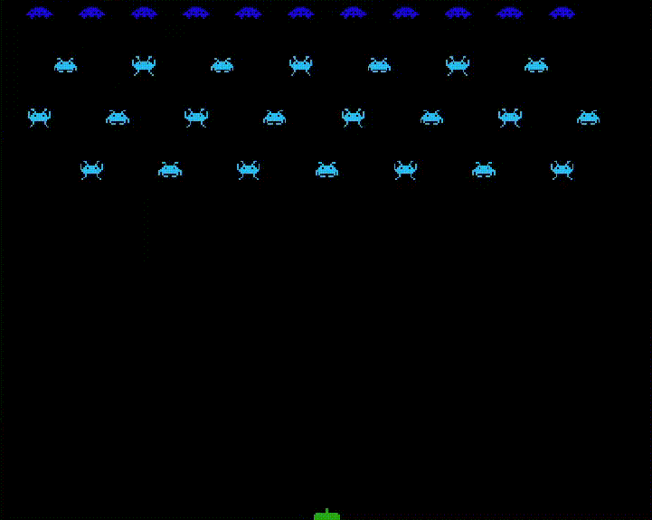

# Sprig Workshop - Advanced Level

## Prerequisites
If you are at this workshop, you should already be familiar with the basic features of Sprig, as this workshop will dive straight into the more advanced stuff. If you haven't already, go check out the beginner level workshop. It is also assumed that you have some familiarity with programming, hopefully in javascript, but not a lot of experience is required to understand this workshop.

### Outline for the workshop
Like the beginner workshop, the new features and advanced game programming patterns that are going to be introduced will also be applied by building a small game. The game that you are going to build by following along the workshop will be a clone of the classic arcade game space invaders, and in it we are going to incorporate a game loop, advanced movement, text, sounds, and animations.

### Getting started
Before jumping straight into coding, it is often better to grab some paper and pencil and sketch out an idea of what you are going to build. Let us do that for our game:
- We want a player ship that we can move side to side using the `A` and `D` keys.
- We want to able to shoot lasers using the `W` key
- We want a bunch of enemy ships that slowly move down toward the player
- We want the enemies to randomly shoot their own lasers at the player
- We also want to incorporate animations and sound effects into the game.
  
Effectively, the end product should look something like this:


## Getting the basic structure down
To begin with, we will create some sprites for the player, enemies, lasers from the player, the lasers from the enemies. We will also create a simple map and set that as the current level. It is encouraged that you come up with your own art for the sprites and your own design for the level.
```
/*
@title: space_invaders_tutorial
@author: stati30241
*/

// Sprites
let player = "p";
let enemy = "e";
let laser = "l";
let enemyLaser = "i";

// Initializes the sprites
setLegend(
  [ player, bitmap`...`],
  [ enemy, bitmap`...`],
  [ laser, bitmap`...`],
  [ enemyLaser, bitmap`...`]
);

// Levels
const levels = [
  map`...`
];
let currentLevel = levels[0];
setMap(currentLevel);
```

### Adding a background
If you run your game now, you will notice that all the sprites are drawn onto the screen, yet something feels off. The game is meant to take place in space, so what is with the white background? We can easily remedy this by using the `setBackground()` function that comes built into Sprig. Simply create a sprite representing the background, and use the function to set it as the default background.
```
// Sprites
let background = "b";
--snip--

// Initializes the sprites
setLegend(
  [ background, bitmap`...`],
  --snip--
);

// Sets the background
setBackground(background);
```
I decided to make the background solid gone, and if you run the game now, you see that the blinding white has been replaced with the nice blackness of space.

### Adding player movement
We want to be able to move the player ship left and right, controlled by the `A` and the `D` keys respectively. This can be done easily using the `onInput()` function; all we need to move the player is increment or decrement the player’s x position.
```
// Handles player movement
onInput("a", () => {
  getFirst(player).x--;
});
onInput("d", () => {
  getFirst(player).x++;
});
```

### Adding laser shooting
