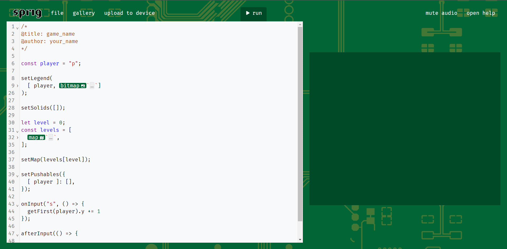

# Sprig Workshop - Beginner Level

## What is Sprig?
Sprig is a open-source handheld console developed by Hack club. It uses a Raspberry Pi Pico and you can write games for it using Javascript. It is a tiny game engine that is embedded into the web and allows for you to quickly create tile-based games. Once you are done building your game, you can share it by making a PR which if approved will add it to the gallery.

## Getting Started
Go to [Sprig editor](https://editor.sprig.hackclub.com/) to start creating your own sprig games.

### Creating and saving a game
When you open up sprig editor, you should be greeted by some code that is already there to serve as a little tutorial. In this workshop we won't need that code, so you can delete everything to get a clean file.

